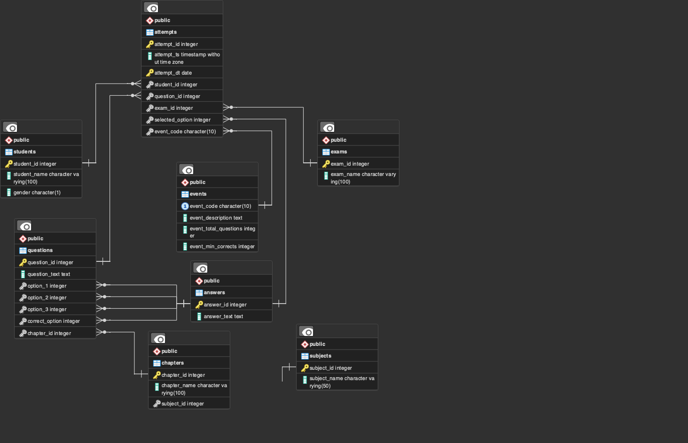

## Designing A Database In Postgres For Data Invloving Typical Online Education Platforms and Competitive Examinations

### This Database Will Be Involving The Performant Capabilities Of Postgres With Data Related To:
1. Students, examinations, scores, subjects, MCQ questions and answers, etc.
2. Students' daily activities on an online education platform.
3. Performances of students.
4. The trend of examinations and subjects among students.

[Fake-Data For This Database](https://github.com/redb17/python-to-postgres)

### Setting Up Role And DB
```sql
-- ROLE
CREATE ROLE user_1 
WITH 
    LOGIN 
    NOSUPERUSER 
    CREATEDB
    NOCREATEROLE
    INHERIT
    NOREPLICATION
    CONNECTION LIMIT -1 
    PASSWORD 'user_1_pw';

-- DB
CREATE DATABASE education
WITH
    OWNER = user_1 
    ENCODING = 'UTF-8' 
    CONNECTION LIMIT = -1;

SET TIMEZONE TO 'UTC';
```

### Designing Relations
The following relations will be required:
1. Students.
2. Exams.
3. Subjects.
4. Chapters.
5. Answers
6. Questions.
7. Events (events like class tests).
8. Attempts (events like question attempts,generated by students on the platform).

*These tables will be holding text data for the questions, answers. These will be large in number and hence the `full text search` feature can be leveraged for performance. A trigger can be set on every insert to trigger a function for generating the `tsvector` for the text column. To further enhance the search, GIN index can be applied to the `tsvector`.*

```sql
-- ADD TSVECTOR FUNCTION
CREATE OR REPLACE FUNCTION fn_add_tsvector() RETURNS TRIGGER AS $$
BEGIN
  NEW.text_vector := to_tsvector('english', NEW.text_description);
  RETURN NEW;
END;
$$ LANGUAGE plpgsql;
```

```sql
-- STUDENTS RELATION
CREATE TABLE students (
    student_id SERIAL PRIMARY KEY,
    student_name VARCHAR(100) NOT NULL,
    gender CHAR(1) CONSTRAINT gender_constraint CHECK (gender in ('M', 'F')),
    phone VARCHAR(30),
    place VARCHAR(20) NOT NULL, -- city/state to find the trend in that place
    addr TEXT
);

CREATE INDEX idx_gin_place_country ON students USING BTREE(place);
```

```sql
-- EXAMS RELATION
CREATE TABLE exams (
    exam_id SERIAL PRIMARY KEY,
    exam_name TEXT NOT NULL
);
```

```sql
-- SUBJECTS RELATION
CREATE TABLE subjects (
    subject_id SERIAL PRIMARY KEY,
    subject_name VARCHAR(100) NOT NULL
);
```

```sql
-- CHAPTERS RELATION
CREATE TABLE chapters (
    chapter_id INTEGER PRIMARY KEY,
    chapter_name VARCHAR(100) NOT NULL,
    subject_id INTEGER REFERENCES subjects (subject_id) -- many to one relation with `subjects`
);
```

```sql
-- ANSWERS RELATION
CREATE TABLE answers (
    answer_id SERIAL PRIMARY KEY,
    text_description TEXT NOT NULL,
    text_vector TSVECTOR
);

CREATE TRIGGER tr_add_tsvector_answers
BEFORE INSERT ON answers
FOR EACH ROW
EXECUTE FUNCTION fn_add_tsvector();

CREATE INDEX idx_gin_text_vector_answers ON answers USING GIN(text_vector);
```

```sql
-- QUESTIONS RELATION
CREATE TABLE questions (
    question_id SERIAL PRIMARY KEY,
    text_description TEXT NOT NULL,
    text_vector TSVECTOR,
    answer_option_1 INTEGER REFERENCES answers (answer_id), -- many to many relation with `answers`
    answer_option_2 INTEGER REFERENCES answers (answer_id),
    answer_option_3 INTEGER REFERENCES answers (answer_id),
    answer_option_correct INTEGER REFERENCES answers (answer_id), -- many to one relation with `answers`
    chapter_id INTEGER REFERENCES chapters (chapter_id) -- many to one relation with `chapters`
);

CREATE TRIGGER tr_add_tsvector_questions
BEFORE INSERT ON questions
FOR EACH ROW
EXECUTE FUNCTION fn_add_tsvector();

CREATE INDEX tr_add_tsvector_questions ON answers USING GIN(text_vector);
```

```sql
-- EVENTS RELATION
CREATE TABLE events (
    event_code CHAR(10) UNIQUE NOT NULL,
    text_description TEXT NOT NULL,
    text_vector TSVECTOR,
    total_questions INTEGER NOT NULL CONSTRAINT positive_val_constraint CHECK (total_questions > 0),
    min_corrects INTEGER NOT NULL CONSTRAINT min_corrects_constraint CHECK (min_corrects BETWEEN 0 AND total_questions)
);

CREATE TRIGGER tr_add_tsvector_events
BEFORE INSERT ON events
FOR EACH ROW
EXECUTE FUNCTION fn_add_tsvector();

CREATE INDEX tr_add_tsvector_events ON answers USING GIN(text_vector);
```

**ATTEMPTS RELATION**

*Attempts table will be containing all the activites on the questions performed by students in different events. This will be the table for deriving other insights like results, students' performances, exams' trends, etc. This will be a large table and hence partitioning it by day can be helpful in performance boost when the insights will be derived on time basis like for some particular event-date, or past some days or months, etc.*

```sql
CREATE TABLE attempts (
    attempt_id SERIAL,
    attempt_ts TIMESTAMP NOT NULL,
    attempt_dt DATE,
    student_id INTEGER REFERENCES students (student_id), -- many to one relation with `students`
    question_id INTEGER REFERENCES questions (question_id), -- many to one relation with `questions`
    exam_id INTEGER REFERENCES exams (exam_id), -- many to one relation with `exams`
    selected_answer_id INTEGER REFERENCES answers (answer_id), -- many to one relation with `answers`
    event_code CHAR(10) REFERENCES events (event_code), -- many to one relation with `events`
    PRIMARY KEY (attempt_id, attempt_dt)
)
PARTITION BY RANGE(attempt_dt);
```

```sql
-- FUNCTION TO CREATE PARTITIONS FOR AN YEAR
CREATE OR REPLACE FUNCTION create_partitions(target_year integer) 
RETURNS void AS 
$$
DECLARE
    start_date date := DATE(target_year || '-01-01');
    end_date date := DATE(target_year || '-12-31');
    current_dt date := start_date;
    partition_name text;
	tomorrow_dt date;
BEGIN
    WHILE current_dt <= end_date LOOP
        partition_name := 'attempts_' || to_char(current_dt, 'YYYY_MM_DD');
        tomorrow_dt := current_dt + 1;
		execute format ('
			create table if not exists %s
			partition of attempts
			for values from (''%s'') to (''%s'');
		', partition_name, current_dt, tomorrow_dt);

		current_dt := current_dt + 1;
    END LOOP;
END;
$$ LANGUAGE plpgsql;

-- HAS TO BE EXECUTED BEFORE THE STARTING OF THE NEXT YEAR
SELECT create_partitions(2023);
```

### ER Diagram



## Insights

### Score Of Each Student In Each Event?
```sql
SELECT STUDENT_ID,
	STUDENT_NAME,
	EVENT_CODE,
	COUNT(*) AS TOTAL,
	SUM(CORRECT) / COUNT(*) * 100 AS SCORE
FROM
	(SELECT ATTEMPTS.STUDENT_ID,
        STUDENTS.STUDENT_NAME,
        ATTEMPTS.EVENT_CODE,
        ATTEMPTS.SELECTED_ANSWER_ID,
        QUESTIONS.ANSWER_OPTION_CORRECT,
        CASE
            WHEN ATTEMPTS.SELECTED_ANSWER_ID = QUESTIONS.ANSWER_OPTION_CORRECT THEN 1
            ELSE 0
        END AS CORRECT
    FROM ATTEMPTS
    LEFT JOIN STUDENTS ON ATTEMPTS.STUDENT_ID = STUDENTS.STUDENT_ID
    LEFT JOIN QUESTIONS ON ATTEMPTS.QUESTION_ID = QUESTIONS.QUESTION_ID)
GROUP BY STUDENT_ID,
	STUDENT_NAME,
	EVENT_CODE
ORDER BY STUDENT_ID,
	STUDENT_NAME,
	EVENT_CODE;
```

### Highest Scoring Student In Each Event?
```sql
WITH RANKED_EVENTS AS
	(SELECT EVENT_CODE,
        STUDENT_ID,
        STUDENT_NAME,
        SCORE,
        ROW_NUMBER() OVER (PARTITION BY EVENT_CODE ORDER BY SCORE DESC) AS RANK
    FROM
        (SELECT STUDENT_ID,
            STUDENT_NAME,
            EVENT_CODE,
            COUNT(*) AS TOTAL,
            SUM(CORRECT) / COUNT(*) * 100 AS SCORE
        FROM
            (SELECT ATTEMPTS.STUDENT_ID,
                STUDENTS.STUDENT_NAME,
                ATTEMPTS.EVENT_CODE,
                ATTEMPTS.SELECTED_ANSWER_ID,
                QUESTIONS.ANSWER_OPTION_CORRECT,
                CASE
                    WHEN ATTEMPTS.SELECTED_ANSWER_ID = QUESTIONS.ANSWER_OPTION_CORRECT THEN 1 ELSE 0
                END AS CORRECT
            FROM ATTEMPTS
            LEFT JOIN STUDENTS ON ATTEMPTS.STUDENT_ID = STUDENTS.STUDENT_ID
            LEFT JOIN QUESTIONS ON ATTEMPTS.QUESTION_ID = QUESTIONS.QUESTION_ID)
        GROUP BY STUDENT_ID,
            STUDENT_NAME,
            EVENT_CODE))
SELECT *
FROM RANKED_EVENTS
WHERE RANK = 1;
```

### Most Popular Exams?
```sql
SELECT ATTEMPTS.EXAM_ID,
	EXAMS.EXAM_NAME,
	COUNT(*) AS TOTAL_ATTEMPTS
FROM ATTEMPTS
LEFT JOIN EXAMS ON ATTEMPTS.EXAM_ID = EXAMS.EXAM_ID
GROUP BY ATTEMPTS.EXAM_ID,
	EXAMS.EXAM_NAME
ORDER BY COUNT(*) DESC;
```

### Top 3 Popular Exams in each Place?
```sql
WITH RANKED_PLACES AS
	(SELECT PLACE,
        EXAM_ID,
        EXAM_NAME,
        TOTAL_ATTEMPTS,
        ROW_NUMBER() OVER (PARTITION BY PLACE ORDER BY TOTAL_ATTEMPTS DESC) AS RANK
    FROM
        (SELECT STUDENTS.PLACE,
            ATTEMPTS.EXAM_ID,
            EXAMS.EXAM_NAME,
            COUNT(*) AS TOTAL_ATTEMPTS
        FROM ATTEMPTS
        LEFT JOIN EXAMS ON ATTEMPTS.EXAM_ID = EXAMS.EXAM_ID
        LEFT JOIN STUDENTS ON ATTEMPTS.STUDENT_ID = STUDENTS.STUDENT_ID
        GROUP BY STUDENTS.PLACE,
            ATTEMPTS.EXAM_ID,
            EXAMS.EXAM_NAME
        ORDER BY STUDENTS.PLACE,
            ATTEMPTS.EXAM_ID,
            EXAMS.EXAM_NAME))
SELECT *
FROM RANKED_PLACES
WHERE RANK <= 3;
```
